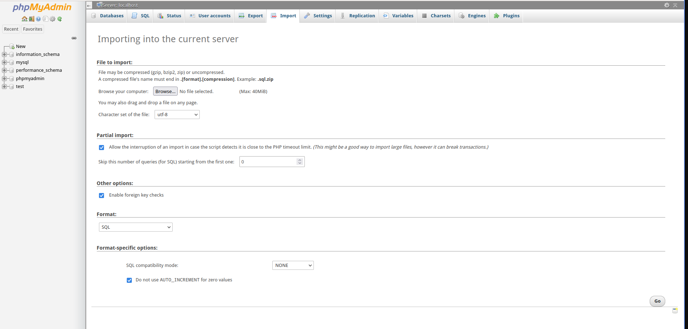

[戻る](../../README.md)

# STEP BY STEP TO IMPORT DATABASE
<h3>Step1</h3>

 

<h3>Step2</h3>

click import menu

 

<h3>Step3</h3>

Browse .sql file 「db_fom.sql」and click Go button

 

<h3>Step4</h3>

if process is success, will appear like this

 

<h3>Step5</h3>

click db_fom from left menu to see all tables

 

<h3>Step6</h3>

Click table to see the table record

 

DONE! 

[戻る](../../README.md)